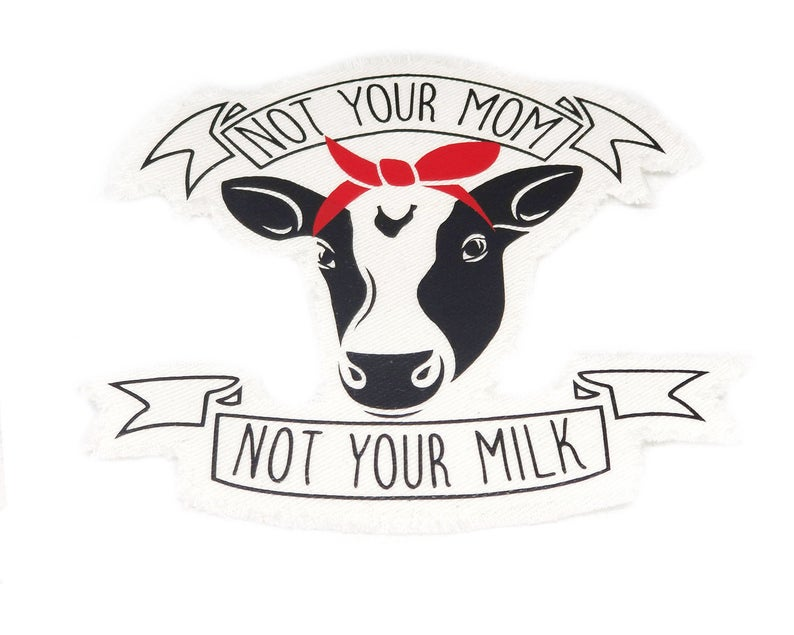

## Overview

The goal of this lab is to explore more plots in `ggplot2`. Specifically we will be focusing on error bars for uncertainty and practice using multiple layers.

## Datasets

We'll be using the `cows.rda`, `cdc.txt`, and `tech_stocks.rda` datasets which are already in the `/data` subdirectory in our **data_vis_labs** project. We will also be using the `mpg` dataset which comes packaged with `ggplot2` --- use `?ggplot2::mpg` to access its codebook.

<br>


```{r L06-setup, message=FALSE, warning=FALSE}
#Load packages 
library(tidyverse) 

# Set seed
set.seed(9876)

#chunk options
knitr::opts_chunk$set(dpi = 300) 
```


```{r L06-load-data}
# load data sets  
load(file = "data/cows.rda") 
load(file = "data/tech_stocks.rda")

# Read in the cdc dataset
cdc <- read_delim(
  file = "data/cdc.txt"
  , delim = "|"
  #add col types 
  , col_types = cols(
                      genhlth = col_character(),
                      exerany = col_double(),
                      hlthplan = col_double(),
                      smoke100 = col_double(),
                      height = col_double(),
                      weight = col_double(),
                      wtdesire = col_double(),
                      age = col_double(),
                      gender = col_character()
                    )
  ) %>%
  mutate(genhlth = factor(genhlth,
    levels = c("excellent", "very good", "good", "fair", "poor")
  ))
```

<br>

## Exercises

<br>

### Exercise 1

The following plot uses the `mpg` dataset.  

```{r L06-class_dat}
# Additional dataset for plot
class_dat <- mpg %>%
  group_by(class) %>%
  summarise(
    n = n(),
    hwy = mean(hwy),
    label = str_c("n = ", n, sep = "")
  )
```

```{r L06-EX1}
ggplot(mpg, aes(class, hwy)) +
  #addjitter plot with all of the points 
  geom_jitter(width = 0.1) +
  #add red points at mean hwy mpg for each class 
  geom_point(data = class_dat, size = 5, color = "red", alpha = 0.6) +
  #add labels with number of vechicals in each class
  geom_text(data = class_dat, aes(label = label, y = 10), vjust = "indward") +
  #change theme
  theme_minimal() +
  #add axis titles 
  labs(
      x = "Vehicle Class"
    , y = "Highway miles per gallon"
  )
```

<br>

### Exercise 2

The following plot uses the `cows` dataset.  

<figure>
  
  <figcaption>
  <a href="https://www.vegansociety.com/go-vegan/dairy-industry" target = "_blank" > The Truth About Dairy </a> | 
  <a href="https://www.etsy.com/listing/670553144/not-your-mom-not-your-milk-vegan-iron-on?ref=shop_home_active_8&frs=1" target = "_blank"> Image Source </a> 
  </figcaption>
</figure>


```{r LO6-canadian-cows}
# Graphic dataset
cow_means <- cows %>%
  filter(breed != "Canadian") %>%
  group_by(breed) %>%
  summarize(
    mean = mean(butterfat),
    se = sd(butterfat) / sqrt(n())
  ) %>%
  mutate(breed = fct_reorder(factor(breed), desc(mean)))
```

```{r L06-EX2}
z_star <- qnorm(0.975)

ggplot(cow_means, aes(breed, mean)) +
  #add color and width 
  geom_col(fill = "#56B4E9", width = 0.7) +
  geom_errorbar(
    #add error bars
      aes(
        ymin = mean - se*z_star
      , ymax = mean + se*z_star
      )
    , width = 0.1
    ) +
  #change theme
  theme_minimal() +
  #add axis titles 
  labs(
      x = "Cattle breed"
    , y = "Mean percent butterfat\ncontent in milk"
  )
```


<br>

### Exercise 3

The following plot uses the `tech_stocks` dataset.  

```{r LO6-percent-increase}
# percentage increase data
perc_increase <- tech_stocks %>%
  ungroup(ticker) %>%
  arrange(desc(date)) %>%
  distinct(company, .keep_all = TRUE) %>%
  mutate(
    perc = 100 * (price - index_price) / index_price,
    label = str_c(round(perc), "%", sep = ""),
    company = fct_reorder(factor(company), perc)
  )
```


```{r L06-EX3}
ggplot(perc_increase, aes(perc, company)) +
  geom_col(fill = "#56B4E9") + 
  geom_text(aes(label = label), size = 5, hjust = 1.1, color = "white") +
  #change theme
  theme_minimal() +
  #remove axis titles 
  labs(
      x = NULL
    , y = NULL
  )
```


<br>

### Exercise 4

The following plot uses the `cdc` dataset.  

```{r}
# 95% CI for weight for genhlth, gender groups
cdc_weight_95ci <- cdc %>%
  group_by(genhlth, gender) %>%
  summarise(
    mean_wt = mean(weight),
    se = sd(weight) / sqrt(n()),
    moe = qt(0.975, n() - 1) * se
  )
```

```{r L06-EX4}
ggplot(cdc_weight_95ci, aes(mean_wt, gender, color = genhlth)) +
  geom_point(position = position_dodge(width = 0.5)) +
  #add HORIZONTAL error bars 
  geom_errorbarh(
      aes(  xmin = mean_wt - moe
          , xmax = mean_wt + moe
          #change height 
          , height = 0.1
          )
    #width refers to size of dodged position; not error bars
   , position = position_dodge(width = 0.5)
    ) +
  theme_minimal() +
  labs(
      x = "Weight (lbs)"
    , y = "Gender"
    ) +
  scale_color_discrete(name = "General health\n(self reported)")
```


