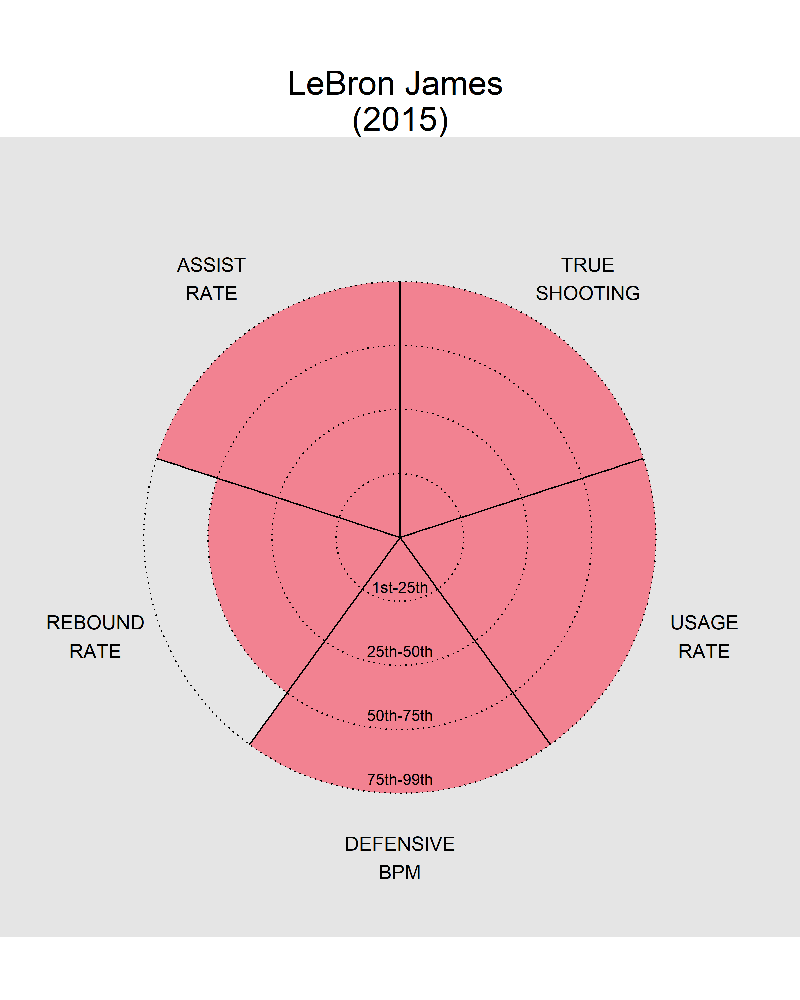

```{r L10-global-options, echo=FALSE}
knitr::opts_chunk$set(dpi = 300)
```

## Overview

The goal of this lab is to use data manipulation and transformation techniques to help use build a few plots. 

## Datasets

We'll be using the `mod_nba2014_15_advanced.txt` and `NU_admission_data.csv` datasets --- add both to the project's **data** subdirectory. The `codebook_mod_nba2014_15_advanced.txt` file supplies a quick description of the variables in the `mod_nba2014_15_advanced.txt` dataset --- suggest adding it to the **data** subdirectory as well. The `undergraduate-admissions-statistics.pdf` is the source for the `NU_admission_data.csv` dataset and it also contains the graphic/plot we will be attempting to re-create in the second exercise. 


```{r L10-packages-data, message=FALSE}
# Load package(s)
library(tidyverse)
library(cowplot)

extrafont::loadfonts(device = "win")

# Read in the datasets
nba <- read_delim(file = "data/mod_nba2014_15_advanced.txt", delim = "|")
admission <- read_csv(file ="data/NU_admission_data.csv") %>%
  janitor::clean_names() #lowercase name
```

```{r L10-NW-colors}
NW_purple   <- "#4E2A84"
NW_purple60 <- "#836EAA"
NW_purple30 <- "#B6ACD1"
NW_black80  <- "#342F2E"
NW_black50  <- "#716C6B"
NW_black20  <- "#BBB8B8"
NW_black10  <- "#D8D6D6"
```

## Exercises


### Exercise 1

Using the `mod_nba2014_15.txt` dataset try to recreate/approximate the plot type featured in the [http://fivethirtyeight.com/](fivethirtyeight.com) article [Kawhi Leonard Is The Most Well-Rounded Elite Shooter Since Larry Bird](http://fivethirtyeight.com/features/kawhi-leonard-is-the-most-well-rounded-elite-shooter-since-larry-bird/) for any player of your choice for the 2014-2015 season. When calculating quartiles or considering players you may want to exclude players that played less than 10 games or played less than 5 minutes a game. That is, we only want to look for "qualified" players.

```{r L10-helper-function}
quartile_rank <- function(x = 0:99) {
  
  # Set quartile
  quart_breaks <- c(
    -Inf,
    quantile(x,
      probs = c(.25, .5, .75),
      na.rm = TRUE
    ),
    Inf
  )

  cut(x = x, breaks = quart_breaks, labels = FALSE)
}
```


```{r L10-EX1-data}
nba_5metrics <- nba %>%
  filter(G >= 10, MP/G >= 5) %>%
  mutate(
     qTS_perc  = quartile_rank(TS_perc)
    , qUSG_perc = quartile_rank(USG_perc)
    , qDBPM     = quartile_rank(DBPM)
    , qTRB_perc = quartile_rank(TRB_perc)
    , qAST_perc = quartile_rank(AST_perc)
  ) %>%
  select(Player, contains("q")) %>%
  pivot_longer(cols = c(-Player), names_to = "metric", values_to = "rank")
```

```{r L10-EX1-func}
plot_nba <- function(fivemetrics, playername){
  #create tidy df for specific player
  player_df <- fivemetrics %>%
    filter(Player == playername) 
    
  #denote limts, breaks and labels 
  x_limits <- player_df$metric
  x_labels <- c(
      "True\nShooting"
    , "Usage\nRate"
    , "Defensive\nBPM"
    , "Rebound\nRate"
    , "Assist\nRate"
  )
  y_breaks <- c(1, 2, 3, 4)
  y_labels <- c("1st-25th", "25th-50th", "50th-75th", "75th-99th")
  
  y_labels_df <- data.frame(
      metric = c(rep("qDBPM", 4 ))
    , y_breaks = y_breaks
    , y_labels = y_labels
  )
  
  #data frame for vertical lines between metrics
  v_lines <- data.frame(
      x    = seq(1.5, 5.5, 1)
    , xend = seq(1.5, 5.5, 1)
    , y    = rep(0, 5)
    , yend = rep(4, 5)
  )
  
  #create plot
  ggplot(player_df, aes(metric, rank)) +
    geom_col(
        width = 1
      , fill  = "#F28291"
    ) +
    coord_polar() + 
    scale_y_continuous(
        NULL
      , expand = c(0, 0)
    ) +
    scale_x_discrete(
        NULL
      , expand = c(0, 0)
      , limits = x_limits 
    ) +
    geom_segment(
        x = seq(0.5, 4.5, 1)
      , y = 0
      , xend = seq(0.5, 4.5, 1)
      , yend = 4
    ) +
    geom_hline(
        yintercept = y_breaks
      , linetype = "dotted"
    )+
    #METRIC LABELS 
    geom_text(
        aes(label = toupper(x_labels), y = 5)
      , size = 5
    ) +
    #RANK LABELS 
    geom_text(
        data = y_labels_df 
      , aes(
            label = y_labels
          , y=y_breaks
          , x=metric
        )
      , vjust = -0.75
      , size = 4
    ) +
    theme_void() +
    ggtitle(paste(playername, "\n(2015)")) +
    theme(
        panel.background = element_rect(
            fill = "grey90"
          , color = NA
        )
      , plot.title = element_text(
            hjust = 0.5
          , size = 24
        )
    )  
  
}
```


```{r L10-EX1-plots, fig.width = 8, fig.height = 10}
# {r, fig.width = 8, fig.height = 10}
#also can print directly
plot_nba(nba_5metrics, "Kevin Durant")
plot_nba(nba_5metrics, "Jeremy Lin")
```

```{r L10-EX1-plotsimport-img, out.width="100%", out.height="100%"}
# {r, out.width="100%", out.height="100%"}
#if you want to save the file and then use it 
png(
    file = "img/LeBron James.png"
  , width = 8
  , height = 10
  , units = "in"
  , res = 300
)

plot_nba(nba_5metrics, "LeBron James")

stop <- dev.off()


```


### Exercise 2

Using `NU_admission_data.csv` create two separate plots derived from the single plot depicted in `undergraduate-admissions-statistics.pdf`. They overlaid two plots on one another by using two y-axes. Create two separate plots that display the same information instead of trying to put it all in one single plot --- consider stacking them with `cowplot::plot_grid()`. Also, improve upon them by (1) fixing their error with the bar heights and (2) by using a "Northwestern" theme. 

Also, practice placing all the text information on the appropriate plots. While I'm not a fan and think it is unnecessary for telling the actual story of the data, sometimes clients want this and there are those that think detailed labeling enhances the plot's value --- they do have a point. When including detailed labeling like this take care to pick label fonts and colors so the text doesn't take away the from the message of the data (the trend in these plots). With these labels you could image removing the y-axes altogether so they don't distracts the reader/consumer. 

Which approach do you find communicates the information better, their single plot or the two plot approach? Why?


```{r, L10-EX2-data-bar}
admission_bar <- admission %>%
  mutate(
      non_admitted = applications - admitted_students
    , non_attended = admitted_students - matriculants
    , attended = matriculants
         ) %>%
  select(year, non_admitted, non_attended, attended)  %>%
  pivot_longer(
      cols = c(-year)
    , names_to = "status"
    , values_to = "count"
  ) %>%
  mutate(
    status = factor(
        status
      , levels = c("attended", "non_attended", "non_admitted")
      )
  )
```

```{r L10-EX2-plot-bar, fig.width = 9, fig.height=3.5}
plot_bar <-  ggplot(admission_bar, aes(year, count, fill = status )) +
  geom_col() +
  scale_fill_manual(
      "Applications"
    , values = c(NW_purple60, NW_purple30, NW_black20)
    , labels = c("Attended", "Admitted but did not attend", "Not Admitted")
  ) +
  scale_x_continuous(
      name = "Entering Year"
    , limits = c(1998.5, 2018.5)
    , breaks = seq(1999, 2018)
    , expand = c(0, 0)
  ) +
  scale_y_continuous(
      name = NULL
    , expand = c(0, 0)
  ) +
  geom_text(
      aes(label = scales::comma(count))
    , position = position_stack(vjust = 0.5)
    , size = 3
    , color = NW_black80
  ) +
  theme_minimal() +
  theme(
      legend.position = "top"
    , axis.title = element_text(color = NW_black80)
    , axis.text = element_text(color = NW_black50)
    , axis.text.y = element_blank()
    , legend.text = element_text(color = NW_black80)
    , legend.title = element_text(family="Georgia", color=NW_black80)
    , line = element_blank()
  )
```

```{r, L10-EX2-data-line}
admission_line <- admission %>%
  select(year, admission_rate, yield_rate) %>%
  pivot_longer(cols = c(-year), names_to = "status", values_to = "rate" ) %>%
  mutate(
    status = factor(status
                    , levels = c("yield_rate", "admission_rate")
                    )
  )
```

```{r L10-EX2-plot-line, fig.width = 9, fig.height=4}
plot_line <-  ggplot(
      admission_line
    , aes(year, rate, color = status, shape = status)
  ) +
  geom_point(size = 2) +
  geom_line(size = 1) +
  scale_color_manual(
      "Rate"
    , values = c(NW_purple, NW_purple60)
    , labels = c("Yield Rate", "Admission Rate")
  ) +
  scale_shape_discrete(
      "Rate"
    , labels = c("Yield Rate", "Admission Rate") 
  ) +
  scale_x_continuous(
      name = "Entering Year"
    , limits = c(1998.5, 2018.5)
    , breaks = seq(1999, 2018)
    , minor_breaks = NULL
    , expand = c(0, 0)
  ) +
  scale_y_continuous(
      name = NULL
    , limits = c(0, 60)
    , expand = c(0, 0)
    , breaks = NULL
  ) + 
  geom_text(
      data = filter(admission_line, status == "yield_rate")
    , aes(y=rate, x=year, label = paste(rate, "%", sep = ""))
    , size = 3
    , color = NW_purple
    , vjust = 0
    , nudge_y = 1.5
  ) +
  geom_text(
      data = filter(admission_line, status == "admission_rate")
    , aes(y=rate, x=year, label = paste(rate, "%", sep = ""))
    , size = 3
    , color = NW_purple60
    , vjust = 1
    , nudge_y = -1.5
  ) + 
  theme_minimal() +
  theme(
      legend.position = "top"
    , axis.title = element_text(color = NW_black80)
    , axis.text = element_text(color = NW_black50)
    , axis.text.y = element_blank()
    , legend.text = element_text(color = NW_black80)
    , legend.title = element_text(
          family="Georgia"
        , color=NW_black80
      )
  )
```

```{r L10-EX2-title}
title <- ggdraw() + 
  draw_label(
      "NORTHWESTERN UNIVERSITY"
    , fontface = 'bold'
    , fontfamily = "Georgia"
    , color = NW_purple
    , x = .5
    , hjust = .5
    , size = 14
  ) +
  theme(
    plot.margin = margin(5, 5, 5, 5)
  )

subtitle <- ggdraw() + 
  draw_label(
      "Undergraduate Admission History"
    , fontfamily = "Georgia"
    , color = NW_black80
    , x = .5
    , hjust = .5
    , size = 12
  ) +
  theme(
    plot.margin = margin(5, 5, 5, 5)
  )

caption <- ggdraw() + 
  draw_label(
      "SOURCE: Information Systems Office for Admissions & Financial Aid."
    , color = NW_black50
    , x = 1
    , hjust = 1
    , size = 10
  ) 
```

```{r L10-EX2-print-plots, fig.width = 9, fig.height=8, warning = FALSE, dpi = 500}
plot_grid(
    plot_grid(title, subtitle, ncol = 1)
  , plot_grid(plot_bar, plot_line, ncol = 1, align = "v")
  , caption
  , ncol = 1
  , rel_heights = c(.1, 1.5, .05)
  )
```


This information is directly connected (one is the the raw counts, the other the rate) - however, putting it all onto one plot makes it difficult to read and see trends.  I think having two plots on top of eachother is a better way to show that the data are related but still allowing enough space to read.  

## Challenge(s)

**No not have to complete.**

Using `NU_admission_data.csv` try to re-create/approximate the single plot depicted in `undergraduate-admissions-statistics.pdf`. Fix their error concerning the bar heights. Might want to simply start with one of your plots from Exercise 2 and see if it can be modified.   

```{r L10-Challenge-prep}
#more colors
NW_orange <- "#CA7C1B"
NW_yellow <- "#FFC520"

#primary/main y-axis limit and breaks 
y1_lim  <- 40000
y1_breaks <- seq(0, y1_lim, 10000)

#secondary y-axis limit and breaks 
y2_lim <- 60
y2_breaks <- seq(0,y2_lim, 15)


transform <- y1_lim*(1/y2_lim)
```

```{r L10-challenge-plot,  fig.width = 9, fig.height=4, dpi = 600}
ggplot(admission_bar, aes(year)) +
  
  #PRIMARY AXIS
  geom_col( aes(y=count, fill = status )) +
  scale_fill_manual(
      name = NULL
    , values = c(NW_purple60, NW_yellow, NW_black20)
    , labels = c("Attended", "Admitted but did not attend", "Not Admitted")
  ) +
  
  #SECONDARY AXIS 
  geom_line( 
      data = admission_line
    , aes(y = rate*transform, color = status)
    , size = 1
  ) +
  geom_point( 
      data = admission_line
    , aes(y = rate*transform, color = status, shape = status)
    , size = 2
  ) +
  scale_color_manual(
      name = NULL
    , values = c(NW_purple, NW_orange)
    , labels = c("Yield Rate", "Admission Rate")
  ) +
  scale_shape_discrete(
      name = NULL
    , labels = c("Yield Rate", "Admission Rate")
  ) +
  
  #SCALING
  scale_x_continuous(
      name = "Entering Year"
    , limits = c(1998.25, 2018.75)
    , breaks = seq(1999, 2018)
    , minor_break = NULL
    , expand = c(0, 0)
  ) +
    scale_y_continuous(
      name = "Applications"
    , expand = c(0, 0)
    , breaks = y1_breaks
    , labels = scales::comma
    , sec.axis = sec_axis(
          ~./transform
        , breaks = y2_breaks
        , labels = scales::unit_format(suffix = "%")
        , name = "Rate"
      )
  ) +
    
    
  #GENERAL THEMES
  theme_minimal() +
  labs(
      title = "NORTHWESTERN UNIVERSITY"
    , subtitle = "Undergradudate Admission History"
    , caption = "SOURCE: Information Systems Office for Admissions & Financial Aid."
  ) +
  theme(
      legend.position = "top"
    , axis.title = element_text(color = NW_black80)
    , axis.text = element_text(color = NW_black50)
    , legend.text = element_text(color = NW_black80)
    , plot.title = element_text(
          color = NW_purple
        , family ="Georgia"
        , face = "bold"
        , hjust = 0.5
      )
    , plot.subtitle = element_text(
          color = NW_black80
        , family ="Georgia"
        , hjust = 0.5
      )
    , plot.caption = element_text(color = NW_black50)
  ) 
```


